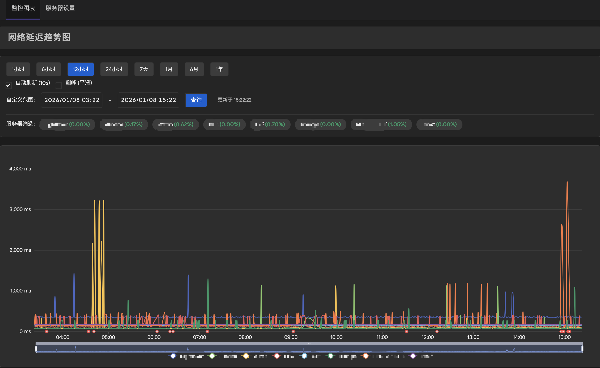

# luci-app-httping



`luci-app-httping` 是一个用于 OpenWrt 的网络延迟监控插件。它支持 **HTTP/HTTPS** 和 **TCPing** 两种模式，探测目标服务器的响应时间，并将数据记录到 SQLite 数据库中，最终通过 ECharts 图表在 LuCI 界面直观展示网络质量趋势。

## 功能特点

* **HTTP/HTTPS 测速**：使用 `curl` 进行精确的握手与传输耗时测量（自动扣除 DNS 解析时间）。
* **TCPing 测速 (New)**：支持对指定端口（如 22, 80, 443 等）进行 TCP 连接检测，支持 IPv4 和 IPv6（格式如 `[IPv6]:Port`）。
* **多服务器支持**：支持同时监控多个目标地址（如百度、Google、GitHub 等）。
* **可视化图表**：集成 ECharts 5.x，提供交互式波形图。
  * 支持缩放、拖拽查看历史数据。
  * 支持服务器快速筛选/对比。
  * **丢包标记**：请求失败或超时会在图表中显示为红色丢包点。
  * **平滑模式**：支持“削峰”功能，过滤异常高延迟噪点。
  * **暗黑模式**：自动适配浏览器的深色模式。
* **灵活配置**：可自定义检测间隔、数据库存储路径。
* **轻量级存储**：使用 SQLite 存储历史数据，支持按需清理。

## 依赖项

本插件依赖以下软件包（安装时会自动安装）：

* `luci-base`
* `luci-lib-jsonc`
* `curl` (用于 HTTP/HTTPS 检测)
* `sqlite3-cli` (用于数据存储)
* `lua` & `luci-base` (内置 nixio 库，用于高精度计时)

## 版本说明

* **v1.1.0**: 重大架构升级：守护进程重构为纯 Lua 实现，移除了对 `socat` 的依赖，大幅优化性能和资源占用。
* **v1.0.20**: 修复 Lua 输出格式化问题 (%.3f)，彻底解决数据记录失败的 bug。
* **v1.0.19**: 修复 Lua 脚本中的格式化字符串错误，解决 TCPing 丢包问题。
* **v1.0.18**: 采用 Lua + socat 混合方案，兼顾高精度计时与极致的连接稳定性。
* **v1.0.16**: 迁移至 socat 以解决编译超时问题，大幅减小体积。
* **v1.0.15**: 优化 TCPing 的 IPv6 兼容性，改用 ncat 作为首选工具。
* **v1.0.13**: 新增 TCPing 功能支持；支持 IPv6；自动迁移旧数据。

## 编译与安装

### 方法 A：直接安装 (推荐)

你可以直接从 [Releases](https://github.com/davidu2003/luci-app-httping/releases) 页面下载预编译好的 `.ipk` 文件。

1. 根据你的路由器架构下载对应的 `.ipk` 文件。
2. 将文件上传到路由器（例如 `/tmp` 目录）。
3. 执行安装命令：

```bash
opkg update
opkg install /tmp/luci-app-httping_*.ipk
```

### 方法 B：自行编译 (可选)

如果你需要自行编译或集成到固件中，请参考以下步骤：

#### 1. 准备 OpenWrt SDK 或源码环境

确保你已经配置好了 OpenWrt 的编译环境。

#### 2. 获取源码

将本仓库克隆到你的 OpenWrt 源码的 `package` 目录下：

```bash
cd package/
git clone https://github.com/davidu2003/luci-app-httping.git
```

#### 3. 配置编译菜单

进入 OpenWrt 源码根目录，运行 menuconfig：

```bash
make menuconfig
```

在菜单中找到并选中：
`LuCI` -> `3. Applications` -> `luci-app-httping`

#### 4. 编译

```bash
make package/luci-app-httping/compile V=s
```

#### 5. 安装

编译完成后，生成的 `.ipk` 文件通常位于 `bin/packages/<arch>/base/` 目录下。上传到路由器并安装：

```bash
opkg update
opkg install luci-app-httping_*.ipk
```

## 使用指南

安装完成后，刷新 LuCI 界面，你可以在 **“服务” (Services)** -> **“网络延迟监控”** 中找到本插件。

### 全局设置

* **启用监控**：勾选后后台守护进程将开始运行。
* **数据库路径**：默认为 `/etc/httping_data.db`，建议保持默认或修改为挂载的外部存储路径（如 U 盘）以避免写入频繁磨损 Flash。
* **管理数据**：点击“清除所有历史数据”可以重置数据库。

### 服务器节点列表

在此处添加你需要监控的目标节点。

* **显示名称**：图表中显示的名称（如 "Google"）。
* **检测类型**：选择 **HTTPing** 或 **TCPing**。
* **地址/URL**：
    * **HTTPing**: 完整的 URL (如 `https://www.google.com`)
    * **TCPing**: `Host:Port` (如 `192.168.1.1:22` 或 `[2001:db8::1]:80`)
* **检测间隔**：建议设置为 60 秒或更长，避免过于频繁的请求。

### 趋势图

点击顶部的 **“网络延迟趋势图”** 标签页查看实时数据。

* 顶部按钮可快速切换时间范围（1小时 ~ 1年）。
* 点击图例或下方的服务器标签可以隐藏/显示特定服务器的曲线。
* 勾选 **“自动刷新”** 可实时监控网络波动。

## 目录结构说明

* `/etc/config/httping`: 配置文件。
* `/usr/bin/httping-daemon.lua`: 后台监控守护脚本 (Lua)。
* `/etc/httping_data.db`: SQLite 数据库文件（默认位置）。

## License

MIT License
